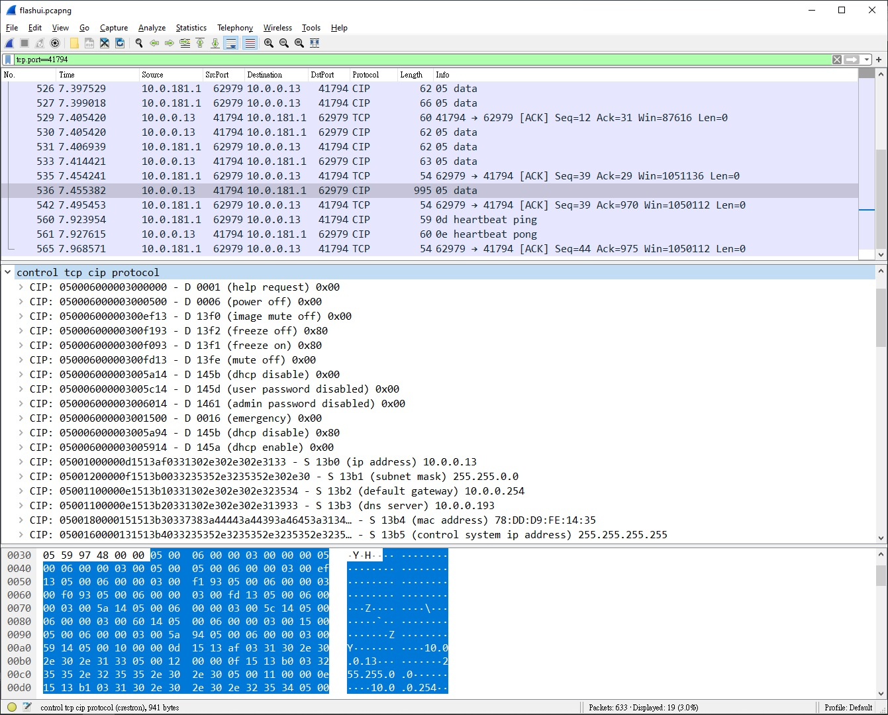
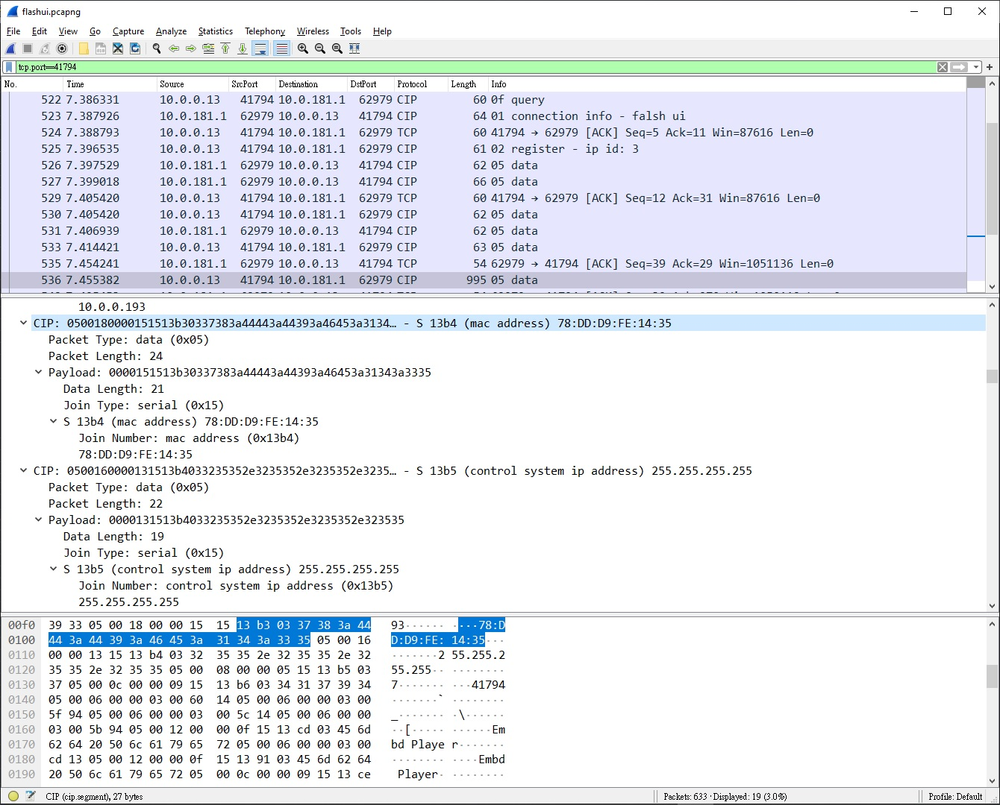

# wireshark lua notes

## references

- [Lua - The Wireshark Wiki](https://wiki.wireshark.org/Lua)
- [Lua Support in Wireshark](https://www.wireshark.org/docs/wsdg_html_chunked/wsluarm.html)
- [Wireshark’s Lua API Reference Manual](https://www.wireshark.org/docs/wsdg_html_chunked/wsluarm_modules.html)
- [Wireshark Lua API Wiki](https://wiki.wireshark.org/LuaAPI)
- [CommandFusion/CIP](https://github.com/CommandFusion/CIP/blob/master/CommandFusion/CIPv1.1.js)
- [rdriscoll/Crestron-CIP](https://github.com/rdriscoll/Crestron-CIP)

## screenshots





## to load wireshark lua scripts

### using one of the following ways to load the lua scripts into wireshark

- copy the lua scripts to plugins folder

    - windows

    copy to global plugins folder

    ```
    copy myscript.lua "c:\Program Files\Wireshark\plugins"
    ```

    copy to personal plugins folder

    ```
    copy myscript.lua %AppData%\Wireshark\plugins\
    ```

    - linux

    ```
    cp myscript.lua /home/$USER/.local/lib/wireshark/plugins/
    ```

- load and execute the script from "c:\Program Files\Wireshark\init.lua"

    ```
    if not running_superuser or run_user_scripts_when_superuser then
        dofile(DATA_DIR.."console.lua")
    end
    --dofile(DATA_DIR.."dtd_gen.lua")

    -- load scripts for additional dissectors
    dofile("/path/to/myscript.lua")
    ```

- launch wireshark from command line

    ```
    wireshark -X lua_script:myscript.lua
    ```

## wireshark-lua development

### Tvb

A Tvb ("Testy Virtual Buffer") represents the packet's buffer. It is passed as an argument to listeners and dissectors, and can be used to extract information (via TvbRange) from the packet's data.

| function | description |
| :-- | :-- |
| tvb:__tostring() | Gets a string representation of the Tvb |
| tvb:__call() | Creates a TvbRange from this Tvb. Same as tvb:range() |
| tvb:len() | Gets the number of bytes in the Tvb |
| tvb:offset() | Gets the raw offset (from the beginning of the source Tvb) of the Tvb |
| tvb:range([offset] [,length]) | Creates a TvbRange from a subset of this Tvb |

### TvbRange

A range of bytes within a Tvb that is used to extract data. A TvbRange is created from tvb:__call() or tvb:range([offset] [,length]).


### Pinfo

Packet information.

| name | description |
| :-- | :-- |
| port_type | type of port of src_port and dst_port. |
| src_port  | source port of this packet |
| dst_port  | destination port of this packet |
| columns  | the Columns object of packet list |

- to display the packet information in packet list.

    ```
    local info = string.format("%02x %s", pkt_type, pkt_types[pkt_type])
    pinfo.cols.info:set(info)
    ```

- to display the protocol in packet list.

    ```
    local protocol = "CIP"
    pinfo.cols.protocol:set(protocol)
    ```
